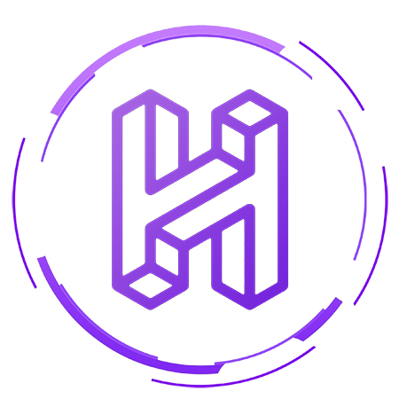

# Contact
There are multiple ways to contact us before and during the hackathon, some of which are listed below. In case of any critical emergency during the hackathon, we recommend you to either directly call the organizers or ask one of our team members for help.

## Email
You can reach us at the following emails:

- HackBMU Team: team@hackbmu.com
- Nirmal Dalmia: nirmal.dalmia.16cse@bml.edu.in
- Saksham Goyal: saksham.goyal.16csc@bml.edu.in
- Vishal Sharma: vishal.sharma.17csc@bml.edu.in

## Phone
You can call us at any of the following numbers:

- Nirmal Dalmia: +91 87083 49747
- Saksham Goyal: +91 99966 03991

## Slack
You can reach us in the #general channel on [Slack](https://hackbmu.slack.com/ "Slack"), or directly DM the organizers.

## Messenger
You can also reach us via Facebook using the Messenger bot on our website, or directly sending a message through our [Facebook page](https://www.facebook.com/HackBMU "Facebook").
